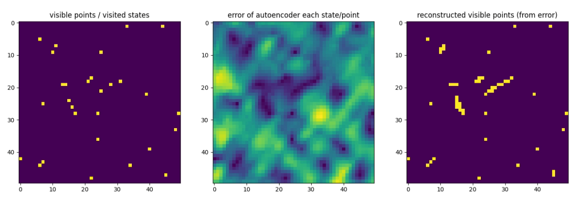
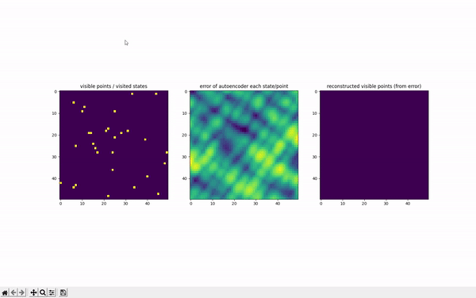
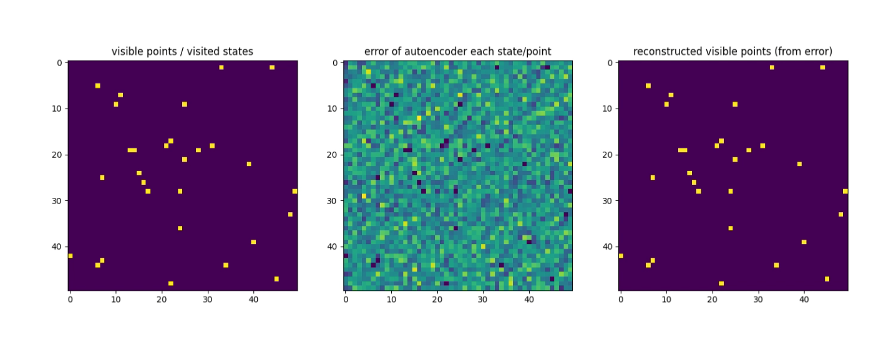
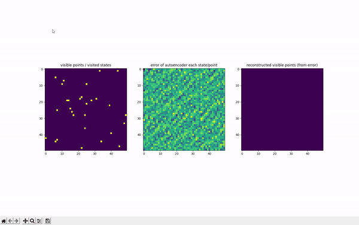

# remember_exploration
autoencoder with adjustable decorrelation of states using random fourier features. 
<b> high correlation between states </b> 
 
 
<b> very low correlation between states </b> 
 
 
